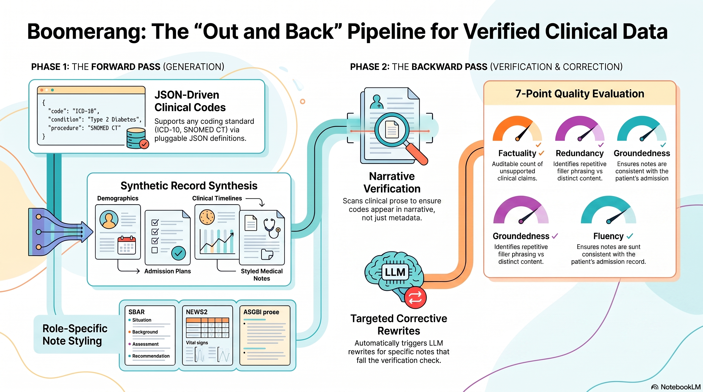
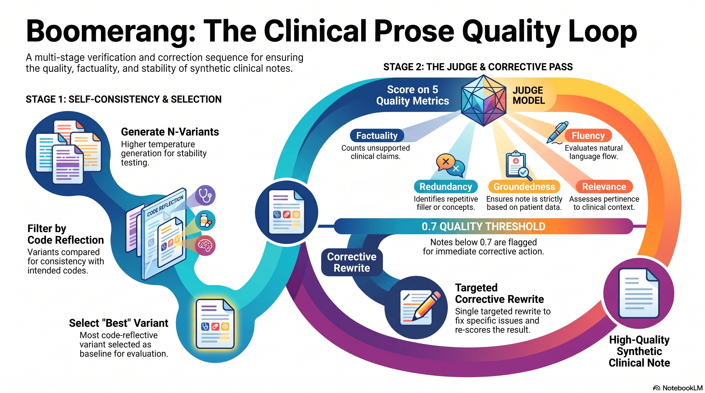

# Boomerang: Synthetic NHS Patient Journeys That Check Themselves on the Way Back

*Built for the Nebius hackathon*


Throw a boomerang and it doesn't just fly away — it comes back, and if
you threw it well, it comes back to your hand. That's the shape of this
project: every patient record it generates goes out as a **forward
pass** — patient, admission, journey, notes — and comes back as a
**backward pass** that checks the thing you actually asked for is in
there, fixing it if it isn't. Out and back. That's the name, and it's
also the whole design.

## The problem

Say you're building a discharge-summary classifier, or testing a
clinical NLP pipeline, or training reviewers on chart abstraction. You
need patient records that look and read like the real thing — messy
NHS demographics, admission notes with a working diagnosis, a clinical
note written the way an actual doctor writes one at 2am. What you
can't have is real patient data, for all the reasons you'd expect.

Most synthetic-data tools solve half of this. Either they hardcode a
single coding standard — good luck if your team works in SNOMED CT
instead of ICD-10 — or they generate plausible-sounding text without
checking it actually reflects the code you asked for. That second gap
is the dangerous one: you ask for `I21.0`, a STEMI (a heart attack),
and get back a discharge summary that never once mentions a heart
attack. It *looks* like data. It isn't the data you asked for.

Boomerang (formerly `serverless-journeys`) is built to close both gaps,
and to do it as a single serverless GPU job on Nebius — no standing
inference endpoint, no separate model-serving infrastructure to babysit.
One container, one job, a batch of verified patients out the other end.

## What it does

Point it at `I21.0` and ask for a handful of patients, and here's what
comes back for each one:

- **A patient** — NHS-style demographics, allergies, past medical
  history, medications, social history.
- **An admission** — specialty, ward, chief complaint, working
  diagnosis, management plan, length of stay, all consistent with a
  STEMI presentation.
- **A journey** — an ordered clinical timeline: ED review, post-take
  ward round, cath lab, therapy review, sized to a configurable target.
- **Clinical notes** — one per journey event, written in the style
  clinicians actually use for that note type: SBAR/NEWS2 bullet points
  for the ED note, ASGBI-standard prose for an operation note, formal
  consultant prose for the ward round.

Every one of those is a real LLM call, prompted with the clinical
context of `I21.0` — not a template with the diagnosis name swapped in.
That's the easy 80%. The interesting part is what happens next.


### It checks its own work



After that patient is generated, a **backward pass** asks a blunt
question: does `I21.0` actually show up anywhere in the admission
record or the notes — not just stamped on as a `diagnostic_codes`
field, but genuinely reflected in the narrative? Sometimes the LLM
drifts. It writes a technically-plausible cardiology admission that
never says "STEMI," "myocardial infarction," or anything close. Ask for
enough patients and this happens more often than you'd like.

When it does, the pipeline doesn't throw the patient away and doesn't
regenerate them from scratch. It makes a **targeted corrective call** —
rewrite just the admission's narrative fields, or just the one note
that should have mentioned it — and checks again. If it still hasn't
landed after the configured number of attempts, that gets logged and
surfaced in the run summary instead of silently shipping. You always
know exactly what you got, not just what you asked for.

### Any coding standard, no code changes

`I21.0` works because ICD-10 is a JSON file, not a code path. Diagnostic
and procedure codes are pluggable: ICD-10 and OPCS-4 ship built-in, but
adding ICD-11, SNOMED CT, CPT, or a private classification means
dropping a JSON file into `code_systems/` — nothing in the pipeline is
hardwired to ICD-10 or OPCS-4. Codes without a curated entry still work:
an optional research mode looks them up via Google Custom Search first,
so generation is grounded in what the code actually means rather than
the model guessing from the bare string.

### Runs as a single Nebius GPU job

Here's the part built specifically for Nebius. `Dockerfile.gpu` packages
a vLLM server *and* the generation pipeline into one image. On startup
the container launches vLLM locally, waits for the model to finish
loading onto the GPU, then points the pipeline at
`http://127.0.0.1:8000/v1` — Nebius's serverless endpoints and vLLM's
own server both speak the OpenAI wire format, so the same client code
just works against either. It runs the full batch and shuts vLLM down
cleanly on exit. Launch one Nebius GPU job — `gpu-l40s-a` for a 7-8B
model, an H100/multi-GPU preset for 70B-class — and you get model
serving and generation as a single ephemeral unit, with nothing left
running afterward. A second, GPU-free image exists for when you'd
rather call an already-running Nebius AI Studio endpoint (or
Anthropic/OpenAI) instead of self-hosting the model.

### One patient at a time was never the plan


The pipeline above describes one `I21.0` patient. Ask for fifty and,
until recently, they generated one after another — each waiting on the
last note's LLM call before starting the next patient. `--concurrency`
fans that out: each patient's pipeline is independent, so a thread pool
runs several at once, bounded by whatever your LLM provider (or your
local vLLM server) can actually handle concurrently. A failed patient
in one worker doesn't touch the others, and the output rows land back
in the same order they would have sequentially — concurrency changes
how fast the batch finishes, not what it looks like once it has.

### Evaluation that acts, not just measures

The backward pass catches "the code isn't in here." It doesn't catch
"the code is in here, but the note is repetitive, invents a lab result
that was never in the admission, or just reads badly." That's a
different, harder question, and it's the one `--evaluate-notes` now
asks properly: alongside readability and the existing fluency/
groundedness/relevance scores, two new LLM-judged metrics —
**factuality** (an auditable count of clinical claims the note makes
that the reference material doesn't support, not just a vague 0–1
score) and **redundancy** (how much of the note is repetition or
filler versus distinct clinical content). And because grading your own
homework is a bad idea, the grading now happens on a separate, larger
**judge model** by default, not the model that wrote the note.

Scoring alone doesn't fix anything, though, which is why a note that
falls below the quality bar on any of those metrics gets a single
targeted rewrite and a re-score — the same "check, then fix" shape as
the code-reflection backward pass, aimed at prose quality instead of
code coverage. And for notes with no ground-truth version to compare
against at all, `--self-consistency-n` generates the same note several
times and checks whether the driving codes show up consistently across
those generations — a note that only reflects `I21.0` in one out of
four attempts is telling you something about how stable that generation
was, before a single judge-model call is spent on it.

---

That's what it feels like from the outside: ask for a code, get back a
verified, quality-checked patient, as many at once as your provider can
take. Here's what actually happens between those moments — still
following `I21.0` all the way through.

## Technical breakdown


### Pipeline architecture

`main.py` runs a fixed, linear pipeline per patient (`run_pipeline`):
parse codes → generate patient → generate admission → generate journey
→ generate notes → verify/correct → optionally evaluate → save. Every
LLM call in every stage goes through one dispatch function,
`processing.call_llm(prompt, model, ...)`, which routes to
`_call_anthropic`, `_call_openai`, or `_call_nebius` based on
`LLM_PROVIDER`. There's no abstract provider interface — the interface
*is* the shared function signature. Anthropic uses
`messages.create(...)`; OpenAI and Nebius both use
`chat.completions.create(...)` through the same `openai` SDK, since
Nebius's endpoint is OpenAI-wire-compatible — Nebius support is just
`_get_nebius_client()` pointing `openai.OpenAI(base_url=...)` at
`NEBIUS_BASE_URL` instead of OpenAI's default. All three paths retry
with exponential backoff and raise after `MAX_LLM_ATTEMPTS`. If a
patient throws at any stage, it's logged and skipped — the batch keeps
going rather than aborting the whole run.

### Fanning that out across patients

That per-patient pipeline is what got wrapped in a
`ThreadPoolExecutor`. Every LLM call in it is I/O-bound — the process
is mostly waiting on a network response — which makes patients an easy
unit of parallelism: nothing in one patient's generation reads or
writes another's state.

```python
concurrency = 1 if args.test_mode else max(1, args.concurrency)
results: list[tuple[int, dict[str, Any] | None]] = []

if concurrency == 1:
    for patient_idx in range(1, n_patients + 1):
        results.append((patient_idx, _generate_one_patient(patient_idx)))
else:
    with ThreadPoolExecutor(max_workers=concurrency) as executor:
        future_to_idx = {
            executor.submit(_generate_one_patient, patient_idx): patient_idx
            for patient_idx in range(1, n_patients + 1)
        }
        for future in as_completed(future_to_idx):
            results.append((future_to_idx[future], future.result()))

for patient_idx, result in sorted(results, key=lambda r: r[0]):
    ...  # append result["patient"]/["admission"]/["journey"]/["notes"] in order
```

`--concurrency 1` (the default) takes the same sequential path as
before — nothing changes unless you opt in. Above that, results come
back keyed by `patient_idx` and get sorted before they're appended to
the output lists, so a run with `--concurrency 8` produces CSV rows in
the same order a sequential run would, regardless of which worker
finished first. A patient that raises still returns `None` from
`_generate_one_patient` instead of propagating — one slow or broken
`I21.0` generation in worker 3 doesn't take down the seven running
alongside it. `--test-mode` forces concurrency back to 1, since the
stub-data path is fast enough that a thread pool would just add
overhead.

### Where I21.0 actually lives

Before any of that runs, `I21.0` gets looked up. `src/codes/registry.py`
defines a generic `CodeSystem` dataclass (`key`, `name`, `kind`,
`codes`, `specialty_field`, `type_field`, `chapter_map`,
`default_specialty`), and every function that touches a code —
`parse_codes`, `lookup_code`, `infer_specialty`, `get_clinical_context`
— operates on a `CodeSystem` value, never on a hardcoded standard.
`I21.0`'s curated entry sits in `code_systems/icd10.json` as plain data:
a description, a specialty, a typical length of stay — exactly the
shape a JSON file for ICD-11 or SNOMED CT would take, which is how
`tests/test_code_registry.py` proves the point by registering a third,
entirely made-up code system and running it through the same code
paths. `src/codes/loader.py` discovers and validates every file under
`code_systems/`, plus an optional `$EXTRA_CODE_SYSTEMS_DIR` — designed
for mounting a private code-system volume into a Nebius job without
rebuilding the image. A malformed file logs a warning and is skipped
rather than crashing the run.

Worth being honest about: `code_systems/opcs4.json` currently ships
with an empty `codes` dict. An NHS classbrowser audit (commit
`7c6ddaa`) found wrong specialty mappings in the curated OPCS-4 data,
and it was pulled pending re-curation rather than shipped known-wrong.
Every OPCS-4 code currently falls through the generic/researched path.
That's the project auditing its own data quality, not a gap that
quietly slipped through.

### The backward pass, in detail

This is the part that turns "STEMI never mentioned" from a silent
failure into a caught and corrected one. `processing.check_code_
reflected(code, code_system, patient, admission, journey, notes)`
builds a "needles" set for `I21.0` — the code itself, plus significant
words (4+ letters) from its curated description, things like
"myocardial" and "infarction" — and substring-searches that set across
four JSON-serialized artifacts. The admission check deliberately
excludes bookkeeping fields (`diagnostic_codes`, `code_reflection_
check` itself) via `_ADMISSION_CODE_BOOKKEEPING_FIELDS`, so a code
can't trivially "pass" just because it's echoed back as metadata — it
has to actually appear in the narrative.

When it doesn't, here's the correction loop, in
`main.step_verify_code_reflection`:

```python
result = processing.check_code_reflected(code, code_system, patient, admission, journey, notes)
attempts = 0
while not (result["admission"] or result["notes"]) and attempts < max_correction_attempts:
    attempts += 1
    code_context = processing.get_code_context(code_system, code, enable_research=..., model=model)
    admission.update(processing.correct_admission_for_code(admission, code, code_context, model=model))
    target_note = _select_note_for_correction(notes, role)  # operation note for procedures, else earliest
    if target_note is not None:
        corrected_text = processing.correct_note_for_code(target_note["clean_note_text"], code, code_context, model=model)
        target_note["clean_note_text"] = corrected_text
        target_note["raw_blob_content"] = corrected_text
    result = processing.check_code_reflected(code, code_system, patient, admission, journey, notes)
report[f"{role}:{code}"] = result
```

Each correction is a single, targeted LLM call — rewrite the
admission's narrative fields, or rewrite one note — never a full
patient re-run. Results are keyed `role:code`, not just `code`, because
the same code string can appear as both a diagnostic and a procedure
code across different systems; an earlier version collided on that
(fixed in commit `70b2333`, alongside a single-note correction bias
where every correction landed on the same note regardless of the
code's role). A code still unreflected after `max_correction_attempts`
(default 1; `0` disables correction entirely) is logged as a warning
and surfaced in `generation_summary.json`'s `code_reflection_check.
unreflected_codes` — the run tells you exactly what didn't land instead
of quietly shipping it as if it had.

### A second backward pass, this time for prose



The code-reflection check answers "is `I21.0` in here." It has nothing
to say about whether the note that mentions it is any good, which is
where `--evaluate-notes` picks up. `evaluate_note` now runs seven
checks per note: the two free readability metrics, plus five LLM-judged
ones — fluency, groundedness, relevance, and the two new arrivals,
factuality and redundancy. `calculate_factuality` in particular is
built to be auditable rather than just a score:

```python
def calculate_factuality(note_text: str, reference_material: str, model: str | None = None) -> dict[str, Any]:
    prompt = evaluation_prompts["calculate_factuality_prompt"].substitute(
        NOTE=note_text, REFERENCE=reference_material
    )
    response = call_llm(prompt, model=model, temp=0.2)
    return parse_llm_json(response)  # -> factuality_score, unsupported_claim_count, unsupported_claims[]
```

It doesn't just return a 0–1 plausibility score the way
`calculate_groundedness` does — it returns a *count* of specific claims
the note makes that the reference material (the patient/admission JSON)
doesn't back up, so a low factuality score comes with a list you can
actually read. All five LLM-judged calls now default to a distinct
**judge model** — `default_judge_model()` resolves `JUDGE_MODEL` /
`--judge-model`, falling back to a provider-specific default that's
deliberately larger than the generation-model default (`claude-opus-4-8`
for Anthropic, for instance, against a generation default of
`claude-sonnet-4-6`) — so the same model isn't grading its own
homework.

Before any of that runs, there's an optional, cheaper filter.
`--self-consistency-n` generates a note multiple times at a higher
temperature and calls `assess_note_consistency`, which reuses the exact
same needle-matching logic as the backward-pass check above — just
applied across variants of one note instead of across patient/admission/
journey/notes:

```python
code_consensus = {
    key: sum(1 for hits in per_variant_hits if key in hits) / n for key in needles_by_code
}
unstable_codes = [key for key, ratio in code_consensus.items() if ratio < consensus_threshold]
consistency_score = sum(code_consensus.values()) / len(code_consensus)
best_variant_index = max(range(n), key=lambda i: len(per_variant_hits[i]))
```

There's no ground-truth note to compare against, so consistency
*across* generations stands in for correctness: if `I21.0` shows up in
four out of five variants, that's a stable generation and the odd one
out gets discarded; the variant reflecting the most driving codes is
kept. It's a free pre-filter — no judge-model call — that runs before
the costlier LLM-judged metrics do.

Finally, none of this scoring changes anything on its own unless
something reads the scores and acts. `step_correct_low_quality_notes`
does that part: any note scoring below `--quality-threshold` (default
0.7) on fluency, groundedness, relevance, or factuality — or above a
fixed redundancy threshold — gets a single targeted rewrite via
`revise_note_for_quality` and a re-score, the same shape as the
code-reflection correction loop, just aimed at "is this well-written
and true" instead of "does this mention `I21.0`." It runs once per
note, not in a retry loop, and is on by default alongside
`--evaluate-notes` (`--no-correct-low-quality` to opt out) — the
project's answer to the difference between measuring quality and doing
something about it.

### Two Docker images, one purpose split

By the time `I21.0` has been checked and, if needed, corrected, the
question of *where* all this ran matters. `Dockerfile` is
`python:3.12-slim` plus the pipeline, for calling an already-running
endpoint — Anthropic, OpenAI, or Nebius AI Studio — no GPU needed.
`Dockerfile.gpu` is built on `vllm/vllm-openai:latest`, adds the
pipeline on top, and swaps the entrypoint for `entrypoint.sh`:

```bash
python3 -m vllm.entrypoints.openai.api_server \
    --model "${MODEL}" --port "${VLLM_PORT}" \
    --gpu-memory-utilization "${VLLM_GPU_MEM_UTIL}" ${VLLM_EXTRA_ARGS:-} &
# poll /v1/models until ready or VLLM_STARTUP_TIMEOUT elapses,
# trap EXIT to kill vLLM on the way out
export LLM_PROVIDER=nebius
export NEBIUS_BASE_URL="http://127.0.0.1:${VLLM_PORT}/v1"
python3 main.py "$@"
```

Because the pipeline's Nebius provider is just the OpenAI SDK against a
configurable `base_url`, pointing it at a local vLLM server instead of
Nebius's hosted endpoint required zero pipeline code changes — only the
entrypoint script changed. That's the same OpenAI-wire-compatibility
that makes Nebius AI Studio a drop-in provider in the first place.
`tests/test_fake_endpoint.py` exercises this at the wire level: a real
local HTTP server speaking the OpenAI chat-completions format, with the
Nebius provider pointed at it, so the integration is tested without
needing real credentials in CI. CI itself
(`.github/workflows/docker-publish.yml`) builds and pushes both images
to GHCR on every push to `main`, tagged `:latest`/`:latest-gpu` plus
sha-tags, from a build matrix over the two Dockerfiles.

### What actually lands on disk

All of this — patient, admission, journey, notes, the `I21.0` check and
whatever correction it triggered — ends up in four CSVs
(`synthetic_patients`, `synthetic_admissions`, `synthetic_journeys`,
`synthetic_clinical_notes`) plus a `generation_summary.json` with run
stats, the code-reflection report, and, with `--evaluate-notes`,
readability and LLM-judged quality scores per note. There's no
pydantic model pinning the output shape — the LLM's JSON response *is*
the schema, enriched with bookkeeping IDs and serialized with pandas.
That's a deliberate trade-off: it keeps the pipeline flexible as
prompts evolve, at the cost of the output shape being defined by the
prompts rather than a strict contract. For a synthetic-data generator
whose whole value proposition is "as realistic and varied as the
underlying LLM can produce," that felt like the right side to be
loose on.

### Testing philosophy

None of the above needs a real API key to validate, which matters for
a project whose core value is a live LLM integration. 14 test files,
151 tests, cover forward-pass (codes actually reach the prompts),
backward-pass (the reflection check itself), full pipeline correction/
reflection wiring end-to-end with `call_llm` mocked, registry
genericity, code research/search clients, the expanded quality-metric
suite (factuality, redundancy, judge-model resolution,
self-consistency, the correction pass), thread-safe concurrent
generation, and the Nebius wire format against a fake local endpoint. A
`--test-mode` flag bypasses all LLM calls with stub data for cheap
pipeline smoke-testing — you can prove the plumbing works before
spending a single token on it.

---

## What's next

The most honest thing in this codebase is what's *missing*. OPCS-4
curated data was pulled after an audit found it wrong, rather than
shipped anyway — that's the immediate next job, re-curating it against
the NHS classbrowser. After that: SNOMED CT as a second built-in coding
standard, to prove the pluggable registry design beyond ICD-10/OPCS-4
in practice, not just in a test that registers a made-up system.

Which is, in a way, the same shape as everything else here. Send the
data out, check what comes back, fix what didn't land, throw it again.
That's a boomerang. That's also just good engineering.
