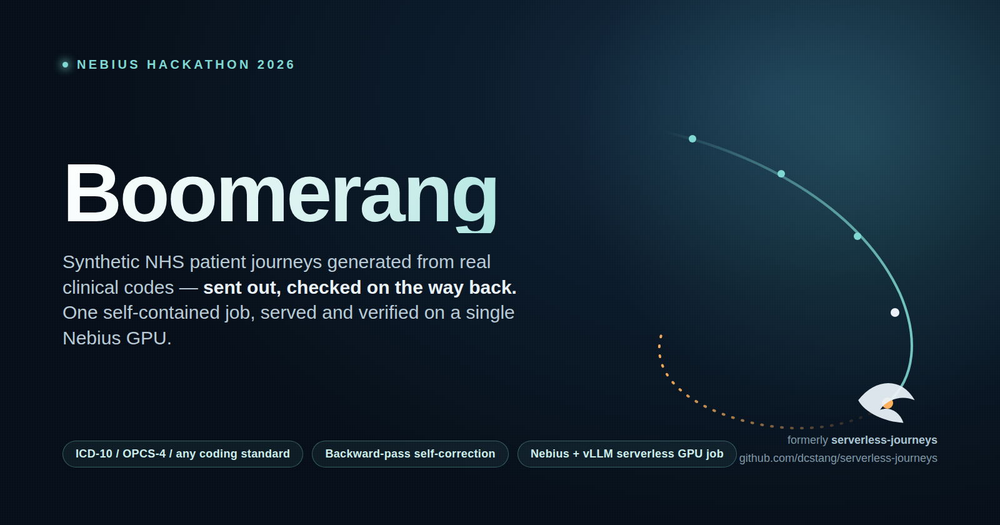
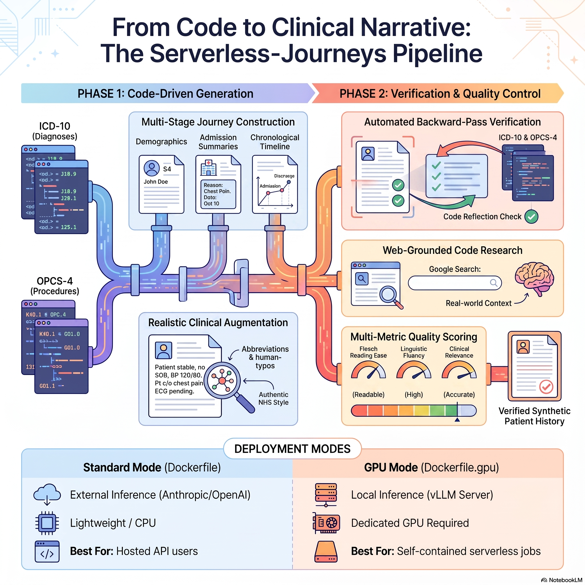

# Boomerang



*(formerly `serverless-journeys`)*

Generate synthetic NHS patient journeys — demographics, admissions, event
timelines, and clinical notes — driven by real diagnostic and procedure
codes (ICD-10, OPCS-4, or any coding standard you register). Built to run
as a single **serverless GPU job on Nebius**: one container spins up a
local vLLM server, generates a full batch of patients against it, and
tears down — no standing inference endpoint required.

A **backward-pass verification step** checks that every code you asked
for actually shows up in the generated content, and automatically
corrects the record when it doesn't — so the codes driving generation
aren't just prompt decoration.

## Why

Clinical NLP and healthcare-ML teams need realistic-looking patient
records to develop and test pipelines without touching real patient
data. Most synthetic-data generators either hardcode a single coding
standard, don't verify that the codes you asked for are reflected in the
output, or need an always-on GPU endpoint to run at all. This project:

- treats coding standards as **pluggable data** (JSON files), not code,
- **verifies and self-corrects** generated content against the driving
  codes instead of trusting the LLM on the first pass,
- runs as a **single self-contained Nebius GPU job** (model serving +
  generation in one container) or against any hosted OpenAI-compatible
  / Anthropic / OpenAI endpoint.

## How it works



For each patient, `main.py` runs a fixed pipeline (`run_pipeline` in
`main.py`):

1. **Parse codes** — look up each diagnostic/procedure code against the
   selected code system (`src/codes/registry.py`).
2. **Generate patient** — one LLM call produces NHS-style demographics
   (name, NHS number, DOB, allergies, PMH, medications, ...).
3. **Generate admission** — one LLM call produces the admission record
   (specialty, ward, chief complaint, working diagnosis, management
   plan, LOS) driven by the parsed codes, or a generic emergency
   admission if none were given.
4. **Generate journey** — one LLM call produces an ordered timeline of
   clinical events (ED review, ward round, operation, therapy, etc.),
   soft-targeted at `--n-events-per-patient`.
5. **Generate notes** — one LLM call per journey event (or
   `--self-consistency-n` calls, *optional*, when self-consistency is
   enabled — see below), using a note-type-specific template and style
   guide (`src/doc_templates.py`, `config/config.py`), with recent events
   as context.
6. **Verify & correct (backward pass)** — for every driving code, check
   it's actually reflected in the admission record or notes (not just
   echoed as metadata). If not, make a **targeted** corrective LLM call
   against just the admission and/or one note — not a full patient
   re-run — and re-check. Repeat up to `--max-correction-attempts`.
7. **Evaluate** *(optional, `--evaluate-notes`)* — score each note for
   readability (Flesch, Gunning Fog) and LLM-judged fluency /
   groundedness / relevance / factuality / redundancy, using a judge
   model kept distinct from the generation model (`--judge-model`, see
   below). Notes scoring below `--quality-threshold` are then revised
   once and re-scored, so the evaluation step acts on quality rather
   than only measuring it (`--no-correct-low-quality` to disable).
8. **Save** — four CSVs (`synthetic_patients`, `synthetic_admissions`,
   `synthetic_journeys`, `synthetic_clinical_notes`) plus a
   `generation_summary.json` with run stats and the code-reflection
   report.

### Self-consistency (no-ground-truth stability check)

With `--self-consistency-n N` (N > 1), each note is generated N times at
a higher temperature before step 5 above picks a winner. Since there's no
ground-truth note to score generations against, stability is measured
indirectly: for each driving code, `assess_note_consistency`
(`src/processing.py`) checks what fraction of the N variants actually
reflect that code, using the same keyword-matching logic as the
backward-pass check in step 6. A code reflected in only one of several
generations is a statistical outlier for that generation. The variant
that reflects the most driving codes is kept, and its `consistency_score`
/ `unstable_codes` are attached to the note record. This runs before the
LLM-judged rubric metrics in step 7, so it's a free (no extra judge LLM
call), code-reflection-based pre-filter rather than a semantic
consensus check over free-text concepts.

### Concurrency

Each patient runs steps 1-7 independently, so `--concurrency N` fans
patient generation out across an `N`-worker thread pool instead of
generating patients one at a time — useful for mass-producing notes.
Output row order stays deterministic (sorted back into `patient_idx`
order after generation) regardless of which worker finishes first, and a
failed patient is logged and skipped without affecting the others,
concurrent or not. Bound `N` by your LLM provider's concurrent-request/
rate-limit quota; `--concurrency` is ignored (forced to 1) in
`--test-mode`.

A patient that fails at any step is logged and skipped; the run
continues with the next one.

## Quickstart

### Local, against a hosted LLM

```bash
pip install -r requirements.txt
cp .env.example .env   # fill in an API key

python main.py --diagnostic-codes I21.0,J18.1 --n-patients 5
```

### Docker, against a hosted endpoint (Anthropic / OpenAI / Nebius AI Studio)

```bash
docker build -t serverless-journeys .
docker run --rm -v $(pwd)/data/output:/data/output \
  -e LLM_PROVIDER=nebius \
  -e NEBIUS_API_KEY=... \
  -e MODEL=meta-llama/Meta-Llama-3.1-70B-Instruct-fast \
  serverless-journeys --diagnostic-codes I21.0 --n-patients 10
```

### Self-contained Nebius GPU job

`Dockerfile.gpu` bundles a vLLM server and the pipeline in one image.
`entrypoint.sh` starts vLLM, waits for the model to load, points the
pipeline's Nebius provider at `http://127.0.0.1:8000/v1`, runs
generation, and tears the server down — a single Nebius GPU job (e.g.
`--platform gpu-l40s-a`) does model serving *and* generation with no
separate standing endpoint.

```bash
docker build -f Dockerfile.gpu -t serverless-journeys-gpu .
docker run --rm --gpus all -v $(pwd)/data/output:/data/output \
  -e MODEL=Qwen/Qwen2.5-7B-Instruct \
  serverless-journeys-gpu --diagnostic-codes I21.0 --n-patients 10
```

Pre-built images are published to GHCR on every push to `main`:
`ghcr.io/<owner>/serverless-journeys:latest` (hosted-endpoint) and
`:latest-gpu` (self-contained GPU job).

## CLI reference

Every flag also has an env-var fallback (see `.env.example`).

| Flag | Default | Purpose |
|---|---|---|
| `--diagnostic-codes` / `--procedure-codes` | — | Comma-separated driving codes |
| `--diagnostic-code-system` / `--procedure-code-system` | `icd10` / `opcs4` | Any registered coding standard key |
| `--n-patients` | 5 | Patients to generate |
| `--concurrency` | 1 | Patients generated in parallel via a thread pool (mass production, bounded by your LLM provider's rate limits) |
| `--n-events-per-patient` | 8 | Soft target for journey length |
| `--llm-provider` | `anthropic` | `anthropic` \| `openai` \| `nebius` |
| `--model` | — | Model id for the selected provider |
| `--research-unknown-codes` | off | Look up uncurated codes via Google Custom Search before generation |
| `--max-correction-attempts` | 1 | Backward-pass corrective retries per code (`0` disables correction) |
| `--evaluate-notes` | off | Score notes for readability / fluency / groundedness / relevance / factuality / redundancy |
| `--judge-model` | provider default, distinct from `--model` | Model used for LLM-judged evaluation metrics |
| `--self-consistency-n` | 1 | Generate each note N times and keep the variant with the most stable code reflection (`1` disables) |
| `--quality-threshold` | 0.7 | Minimum acceptable score before a note is revised (`--evaluate-notes` only) |
| `--no-correct-low-quality` | off | Disable the corrective revise-and-rescore pass on low-scoring notes |
| `--apply-abbreviations` / `--apply-typos` | off | Realism augmentation |
| `--test-mode` | off | Bypass all LLM calls with stub data, for cheap pipeline testing |
| `--output-dir` | `data/output` | Where CSVs + summary land |

Run `python main.py --help` for the full list.

## Pluggable coding standards

Coding standards are data, not code. `code_systems/icd10.json` and
`code_systems/opcs4.json` ship built-in; adding another standard (ICD-11,
SNOMED CT, CPT, a private classification) means dropping a JSON file
under `code_systems/` with this shape — no Python changes:

```json
{
  "key": "icd11",
  "name": "ICD-11",
  "kind": "diagnostic",
  "specialty_field": "specialty",
  "type_field": "admission_type",
  "default_specialty": "General Medicine",
  "chapter_map": { "1": "Infectious diseases" },
  "codes": {
    "CODE": { "description": "...", "specialty": "...", "typical_los_days": [4, 7] }
  }
}
```

`src/codes/registry.py` and `src/codes/loader.py` discover and load
every file in `code_systems/`, plus an optional `$EXTRA_CODE_SYSTEMS_DIR`
— intended for mounting a private code-system volume into a Nebius job
without rebuilding the image. Codes without a curated entry still work:
the pipeline falls back to a generic description (or, with
`--research-unknown-codes`, a Google-Search-grounded lookup) rather than
failing. This genericity is covered by `tests/test_code_registry.py`,
which registers a third, made-up code system and runs it through the
same pipeline code paths.

## Testing

```bash
pytest
```

13 test files cover: forward-pass code injection into prompts,
backward-pass reflection checks, end-to-end pipeline correction and
reflection wiring, code-system registry/loader genericity, code
research and search clients, note quality metrics, and the Nebius
provider against a local fake OpenAI-compatible HTTP server
(`tests/test_fake_endpoint.py` — no real credentials needed to test the
Nebius wiring).

## License

MIT — see [LICENSE](LICENSE).
